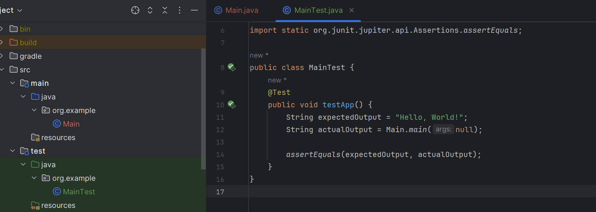

Hello, this task is done using Github Actions

[]

First of all, I provide you with script that I code for test purposes on Java language.

Here is the code of the 'main' class script


And below you can see the code of the 'maintest' class script




Here is the result of script that 'test passed'.


Now, it's time to task requirement that protecting 'develop' branch with successful Github action run.
Let's do this.

1.First we enter 'Settings/Branches/Add rule' and add rule for 'develop' branch for our repository.


2.I select below Branch protection rules for 'develop' branch.
* Require pull requests before merging
* Require review from at least one person
* Require status checks to pass before merging
* Require deployment to succeed before merging


As a result, no one will be able to push changes to the "develop" branch unless they meet all of the requirements that you specified in the rule.


For now, it's time to do task for workflow on Github action using JUnit.

1.First of all, let's create file 'junit-test.yml' in '.github/workflows' directory.


2.Now, it's time to add Junit Test status into our Readme file.
I did this by below code.
```markdown
[](https://github.com/<username>/<repository>/actions/workflows/junit-tests.yml)
```

You can look at the real one, at the top of README.md file.


Finally, it's time to do last part of task that make PR from 'feature/lab2' branch to 'develop' branch 

Before image of Github Actions


Now, let's open PR.


